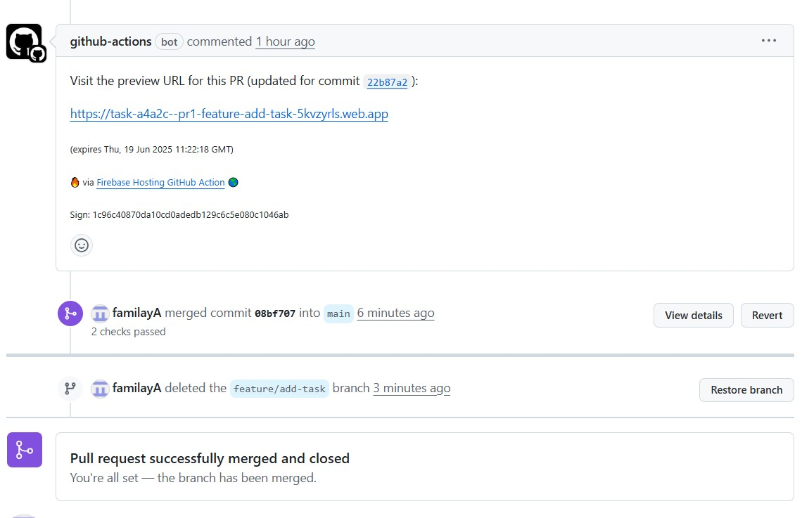
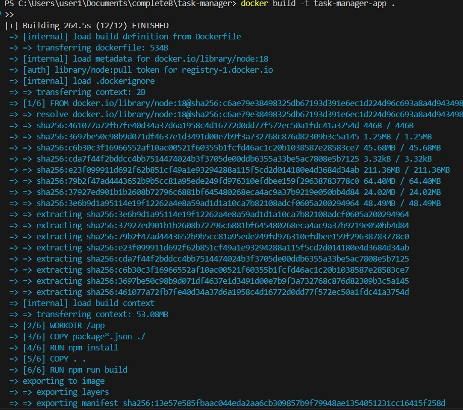
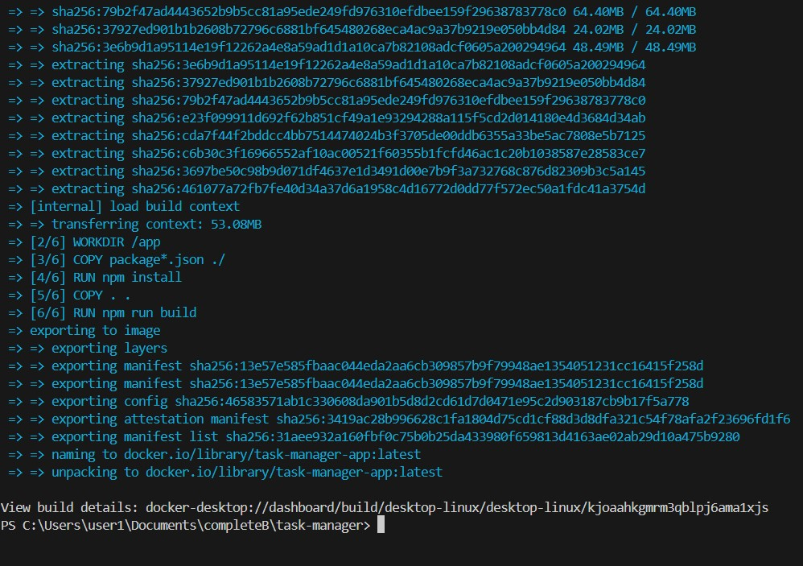
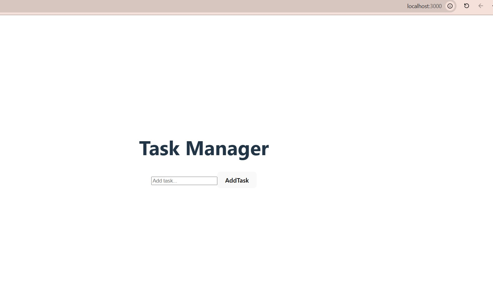
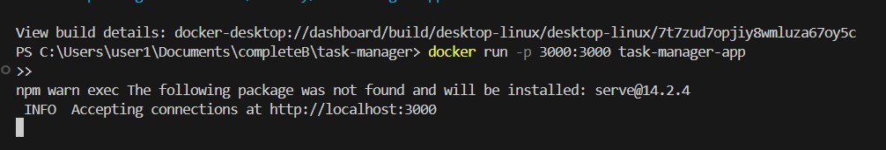
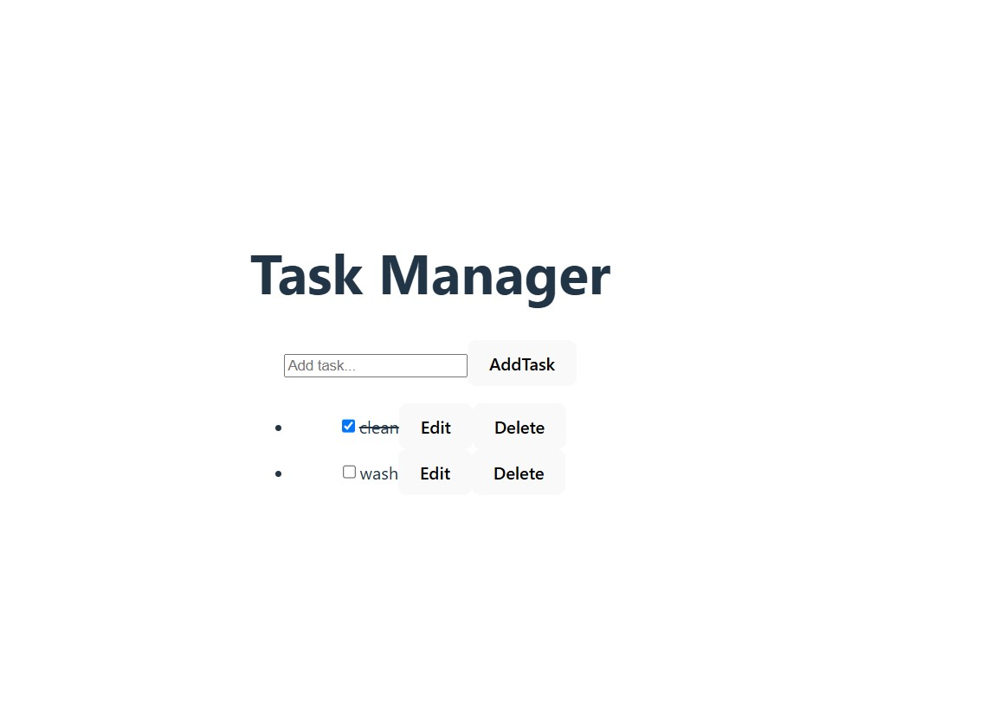

📝 Task Management App
A simple task management application built with Vite + React and deployed to Firebase Hosting.
This project includes user authentication, task creation and status updates, with full CI/CD integration using GitHub Actions.

🚀 Installation & Running Locally
Clone the repository:
git clone https://github.com/familayA/task-manager-system.git

Install dependencies:
npm install

Run the development server:
npm run dev

Build for production:
npm run build

Preview build (optional):
npm run preview

🏗️ Architecture Overview
Frontend Framework: Vite + React

Authentication: Firebase Auth

Database (optional): Firebase Firestore

Hosting: Firebase Hosting

CI/CD: GitHub Actions – automatic deploy on PR and main branch merges

Routing: React Router

Styling: Tailwind CSS

📁 Project Structure:
├── public/
├── src/
│   ├── components/
│   ├── pages/
│   ├── services/         # Firebase connection & API
│   └── App.jsx
├── firebase.json
├── README.md
└── ...

 GitHub Actions & Firebase
This project is configured to automatically:

Preview PRs via Firebase Hosting with temporary preview URLs.

Deploy the app to the live site when merged into the main branch.

Example PR preview URL:
https://task-a4a2c--pr1-feature-add-task-5kvzyrls.web.app/

Live site URL (after merging):
https://task-a4a2c.web.app/

🖼️ Screenshots:
PRexecution:

RunningBuild1:

RunningBuild2:

RunningDockerInLocalhost3000:

DockerRunCommand:

ResultsAfterRunning&UsingTheSystem:
